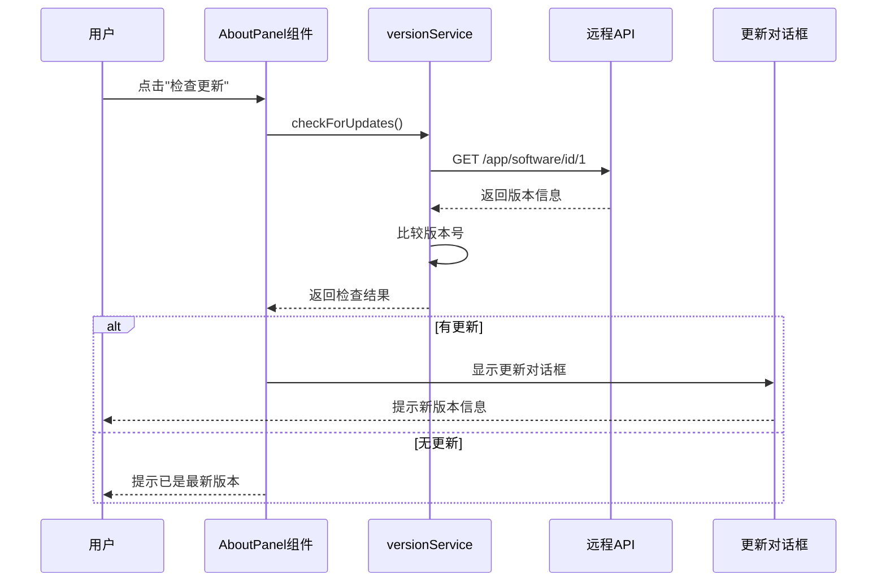
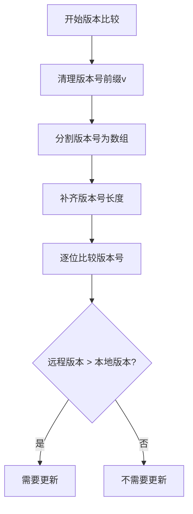
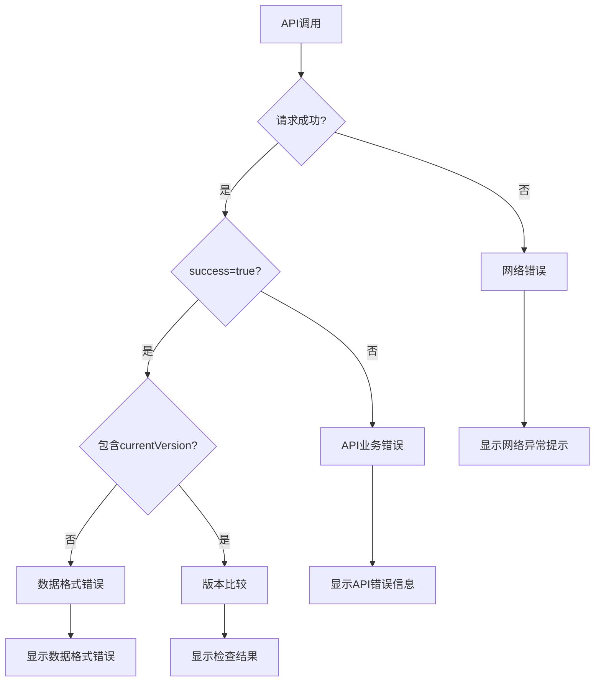

# 检查更新逻辑设计文档

## 概述

本文档描述了玩机管家（ADMT）应用中"检查更新"功能的设计方案。该功能通过调用远程API获取最新版本信息，并与本地版本进行比较，判断是否需要更新。

## 现状分析

### 现有组件结构

当前应用已具备以下相关组件：

- **AboutPanel.tsx**: 设置面板中的关于页面，包含"检查更新"按钮
- **versionService.ts**: 版本检查核心服务，实现版本比较和API调用
- **unifiedVersionService.ts**: 统一版本服务，提供更完整的版本管理
- **VersionChecker.tsx**: 版本检查组件，支持自动检查和对话框显示

### API接口分析

根据示例响应数据，API端点 `https://api-g.lacs.cc/app/software/id/1` 返回结构：

```json
{
  "success": true,
  "data": {
    "currentVersion": "2.0.0",
    "officialWebsite": "https://admt.lacs.cc",
    "latestDownloadUrl": "https://csmt.lacs.cc/"
  }
}
```

关键字段：
- `data.currentVersion`: 当前最新版本号（需要与本地版本比较）

## 设计方案

### 功能需求

1. **版本检查触发**: 用户点击AboutPanel中的"检查更新"按钮
2. **版本比较**: 比较API返回的`currentVersion`与本地版本号
3. **结果展示**: 显示检查结果（有更新/已是最新版本）
4. **错误处理**: 网络异常、API错误等情况的处理

### 架构设计



### 版本比较逻辑

使用现有的`isUpdateRequired`函数实现语义化版本号比较：



支持的版本格式：
- `1.0.0` vs `2.0.0` → 需要更新
- `v1.0.0` vs `v1.0.1` → 需要更新  
- `1.0` vs `1.0.0` → 不需要更新

### 组件交互设计

#### AboutPanel组件更新

在现有`handleCheckUpdate`函数基础上，集成版本检查逻辑：

```typescript
const handleCheckUpdate = async () => {
  try {
    setIsCheckingUpdate(true);
    
    // 调用版本检查服务
    const result = await versionService.checkForUpdates();
    
    if (result.hasUpdate) {
      // 显示更新对话框
      setUpdateDialogOpen(true);
      setUpdateInfo(result);
    } else {
      // 显示已是最新版本提示
      showNoUpdateNotification();
    }
  } catch (error) {
    // 显示错误提示
    showErrorNotification(error.message);
  } finally {
    setIsCheckingUpdate(false);
  }
};
```

#### 状态管理

添加以下状态变量：

```typescript
const [isCheckingUpdate, setIsCheckingUpdate] = useState(false);
const [updateDialogOpen, setUpdateDialogOpen] = useState(false);
const [updateInfo, setUpdateInfo] = useState<VersionCheckResult | null>(null);
```

#### 更新对话框

设计更新提示对话框：

```typescript
interface UpdateDialogProps {
  open: boolean;
  onClose: () => void;
  updateInfo: VersionCheckResult;
}
```

对话框内容：
- 当前版本 vs 最新版本
- 更新说明（固定文案）
- 操作按钮（立即下载、稍后提醒、忽略）

### API接口适配

#### 请求配置

使用现有API配置：

```typescript
const API_URL = 'https://api-g.lacs.cc/app/software/id/1';
const REQUEST_TIMEOUT = 10000; // 10秒超时
```

#### 响应数据处理

```typescript
interface ApiResponse {
  success: boolean;
  data: {
    currentVersion: string;
    officialWebsite?: string;
    latestDownloadUrl?: string;
  };
  message?: string;
}
```

只解析`data.currentVersion`字段进行版本比较，其他信息使用固定配置。

### 错误处理策略



错误类型及处理：

1. **网络错误**: 显示"网络连接异常，请检查网络后重试"
2. **API错误**: 显示API返回的错误信息
3. **超时错误**: 显示"请求超时，请稍后重试"
4. **数据格式错误**: 显示"数据格式异常，请联系技术支持"

### 用户体验设计

#### 加载状态

- 点击"检查更新"按钮后显示加载状态
- 按钮文字变为"检查中..."并显示旋转图标
- 禁用按钮防止重复点击

#### 结果反馈

**有更新时**：
- 弹出更新对话框
- 显示版本对比信息
- 提供下载链接

**无更新时**：
- 显示轻量级提示："当前已是最新版本"
- 3秒后自动消失

**出错时**：
- 显示错误提示对话框
- 包含错误详情和重试按钮

## 实现计划

### 阶段一：基础功能
1. 修改`handleCheckUpdate`函数，集成版本检查逻辑
2. 添加加载状态和错误处理
3. 实现基础的结果提示

### 阶段二：用户界面
1. 设计并实现更新对话框组件
2. 优化加载状态的视觉效果
3. 完善错误提示的用户体验

### 阶段三：优化完善
1. 添加缓存机制，避免频繁请求
2. 实现版本检查结果的持久化
3. 添加自动检查更新的选项

## 技术规范

### 代码风格
- 使用TypeScript严格模式
- 遵循React Hooks最佳实践
- 采用函数式组件编程风格

### 性能要求
- API请求超时时间不超过10秒
- 界面响应时间不超过100ms
- 错误恢复时间不超过3秒

### 兼容性
- 支持Windows 10/11
- 兼容Tauri 2.0运行环境
- 适配高DPI显示器