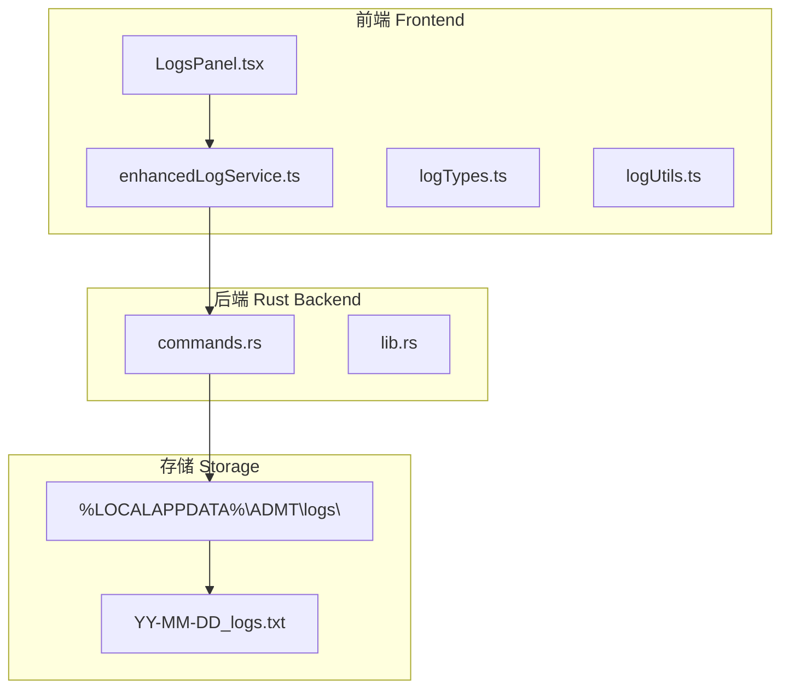
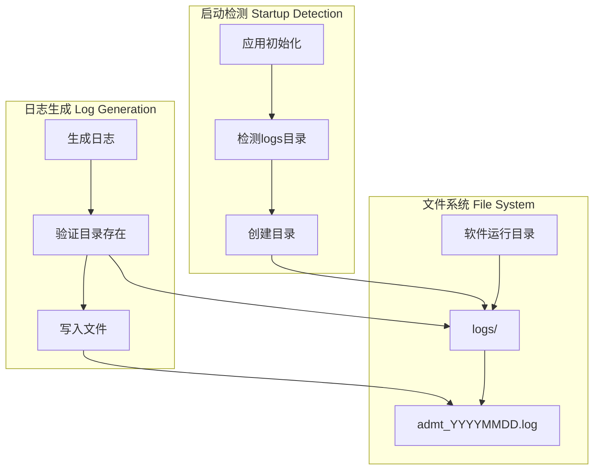

# 日志文件管理设计

## 概述

本设计文档描述了ADMT应用日志文件命名和存储位置的改进方案。目标是将日志文件命名规范化为以"admt"开头的格式，并将存储位置从系统数据目录迁移到软件运行目录，提升日志文件的可访问性和管理便利性。

## 当前状况分析

### 现有日志系统架构



### 现有实现问题

1. **文件命名不一致**: 当前使用格式 `YY-MM-DD_logs.txt`，不包含应用标识
2. **存储位置隐蔽**: 日志文件存储在系统数据目录，用户难以直接访问
3. **目录检测逻辑**: 缺乏启动时目录存在性检测和自动创建机制

## 设计目标

### 核心需求

1. **新文件命名格式**: `admt_YYYYMMDD.log`
   - 以"admt"开头，明确标识应用
   - 使用完整日期格式(8位数字)
   - 文件扩展名改为`.log`

2. **新存储位置**: `{软件运行目录}/logs/`
   - 相对于应用可执行文件的路径
   - 便于用户直接访问和管理

3. **目录管理机制**:
   - 应用启动时自动检测logs目录是否存在
   - 不存在时自动创建目录
   - 生成日志文件时再次验证目录存在性

## 架构设计

### 新日志文件管理架构



### 目录结构变更

```
// 当前结构
%LOCALAPPDATA%\ADMT\logs\
├── 25-09-13_logs.txt
├── 25-09-14_logs.txt
└── 25-09-15_logs.txt

// 新结构
{软件运行目录}/logs/
├── admt_20250913.log
├── admt_20250914.log
└── admt_20250915.log
```

## 技术实现

### 后端Rust实现

#### 目录路径获取函数修改

```rust
/// 获取应用数据目录 - 修改为使用运行目录
fn get_app_data_dir() -> Result<std::path::PathBuf> {
    // 获取当前可执行文件的目录
    let exe_path = std::env::current_exe()
        .map_err(|e| HoutError::IoError { 
            message: format!("获取可执行文件路径失败: {}", e) 
        })?;
    
    let app_dir = exe_path.parent()
        .ok_or_else(|| HoutError::IoError { 
            message: "无法获取可执行文件目录".to_string() 
        })?;
    
    Ok(app_dir.to_path_buf())
}
```

#### 启动时目录检测

```rust
/// 应用启动时检测并创建日志目录
#[tauri::command]
pub async fn initialize_log_directory() -> Result<String> {
    let app_dir = get_app_data_dir()?;
    let logs_dir = app_dir.join("logs");
    
    if !logs_dir.exists() {
        std::fs::create_dir_all(&logs_dir)
            .map_err(|e| HoutError::IoError { 
                message: format!("创建日志目录失败: {}", e) 
            })?;
        log::info!("创建日志目录: {}", logs_dir.display());
    } else {
        log::info!("日志目录已存在: {}", logs_dir.display());
    }
    
    Ok(logs_dir.to_string_lossy().to_string())
}
```

#### 文件命名格式修改

```rust
/// 持久化日志到文件 - 使用新命名格式
#[tauri::command]
pub async fn persist_log_to_file(log_entry: String) -> Result<String> {
    use std::fs::OpenOptions;
    use std::io::Write;
    
    let entry: StructuredLogEntry = serde_json::from_str(&log_entry)
        .map_err(|e| HoutError::InvalidInput { 
            message: format!("解析日志失败: {}", e) 
        })?;
    
    // 新文件名格式：admt_YYYYMMDD.log
    let date_str = Local::now().format("%Y%m%d").to_string();
    let filename = format!("admt_{}.log", date_str);
    
    let app_dir = get_app_data_dir()?;
    let logs_dir = app_dir.join("logs");
    
    // 确保日志目录存在
    std::fs::create_dir_all(&logs_dir)
        .map_err(|e| HoutError::IoError { 
            message: format!("创建日志目录失败: {}", e) 
        })?;
    
    let log_file_path = logs_dir.join(&filename);
    
    // 格式化并写入日志
    let formatted_log = format_log_entry(&entry);
    
    let mut file = OpenOptions::new()
        .create(true)
        .append(true)
        .open(&log_file_path)
        .map_err(|e| HoutError::IoError { 
            message: format!("打开日志文件失败: {}", e) 
        })?;
    
    writeln!(file, "{}", formatted_log)
        .map_err(|e| HoutError::IoError { 
            message: format!("写入日志失败: {}", e) 
        })?;
    
    log::debug!("日志已持久化到文件: {}", log_file_path.display());
    Ok(log_file_path.to_string_lossy().to_string())
}
```

### 前端TypeScript实现

#### 启动时初始化

```typescript
// enhancedLogService.ts 修改
class EnhancedLogService {
  private async initializeService(): Promise<void> {
    try {
      // 初始化日志目录
      await invoke('initialize_log_directory');
      
      // 清理过期日志
      await this.cleanupExpiredLogs();
      
      this.logStructured({
        level: "info",
        category: "system",
        message: "增强日志服务已启动 - 使用新日志格式",
        source: "EnhancedLogService",
        context: {
          sessionId: this.sessionId,
          retentionPolicy: this.retentionPolicy,
          logFormat: "admt_YYYYMMDD.log"
        }
      });
    } catch (error) {
      console.error("日志服务初始化失败:", error);
    }
  }
}
```

#### UI组件更新

```typescript
// LogsPanel.tsx 信息显示更新
const LogsPanel: React.FC = () => {
  // ... 其他代码 ...
  
  return (
    <div className={styles.container}>
      {/* 日志配置信息 */}
      <div className={styles.logInfoRow}>
        <div style={{ display: "flex", alignItems: "center", gap: "8px" }}>
          <Folder24Regular />
          <Text size={200}>日志保存位置: </Text>
          <Text size={200} style={{ 
            fontFamily: "monospace", 
            backgroundColor: "var(--colorNeutralBackground2)", 
            padding: "2px 6px", 
            borderRadius: "4px" 
          }}>
            {软件运行目录}/logs/
          </Text>
        </div>
        <div>
          <Text size={200}>文件格式: admt_YYYYMMDD.log</Text>
        </div>
      </div>
      {/* ... 其他UI组件 ... */}
    </div>
  );
};
```

## 兼容性考虑

### 向后兼容性


#### 迁移策略

1. **检测旧日志文件**: 启动时检查系统数据目录是否存在旧格式日志
2. **提供迁移选项**: 询问用户是否迁移现有日志文件
3. **并行支持**: 短期内同时支持读取两种格式的日志文件

### 错误处理

```typescript
// 目录创建失败的降级处理
async function createLogDirectoryWithFallback(): Promise<string> {
  try {
    // 尝试在运行目录创建
    return await invoke('initialize_log_directory');
  } catch (error) {
    console.warn("在运行目录创建日志目录失败，降级到临时目录", error);
    
    // 降级到系统临时目录
    const tempDir = await invoke('get_temp_directory');
    const logDir = path.join(tempDir, 'admt_logs');
    await invoke('create_directory', { path: logDir });
    return logDir;
  }
}
```

## 部署考虑

### 文件权限

- **运行目录写权限**: 确保应用对运行目录具有写权限
- **权限检测**: 启动时检测目录创建和文件写入权限
- **错误提示**: 权限不足时向用户提供明确的错误信息

### 不同操作系统支持

```rust
// 跨平台目录处理
fn get_app_data_dir() -> Result<std::path::PathBuf> {
    let exe_path = std::env::current_exe()
        .map_err(|e| HoutError::IoError { 
            message: format!("获取可执行文件路径失败: {}", e) 
        })?;
    
    let app_dir = exe_path.parent()
        .ok_or_else(|| HoutError::IoError { 
            message: "无法获取可执行文件目录".to_string() 
        })?;
    
    // 在不同操作系统上都使用相同的logs子目录
    Ok(app_dir.join("logs"))
}
```

## 测试策略

### 单元测试

```rust
#[cfg(test)]
mod tests {
    use super::*;
    use tempfile::TempDir;
    
    #[test]
    fn test_log_file_naming() {
        let date = Local::now().format("%Y%m%d").to_string();
        let expected = format!("admt_{}.log", date);
        
        // 测试文件名生成逻辑
        assert_eq!(generate_log_filename(), expected);
    }
    
    #[test]
    fn test_directory_creation() {
        let temp_dir = TempDir::new().unwrap();
        let logs_dir = temp_dir.path().join("logs");
        
        // 测试目录创建
        assert!(create_log_directory(&logs_dir).is_ok());
        assert!(logs_dir.exists());
    }
}
```

### 集成测试

1. **启动时目录检测**: 验证应用启动时正确检测和创建日志目录
2. **日志文件生成**: 确认新格式日志文件正确生成
3. **权限处理**: 测试不同权限情况下的降级处理
4. **跨平台兼容**: 在Windows、Linux、macOS上验证功能