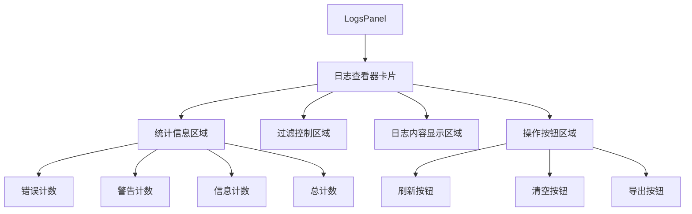
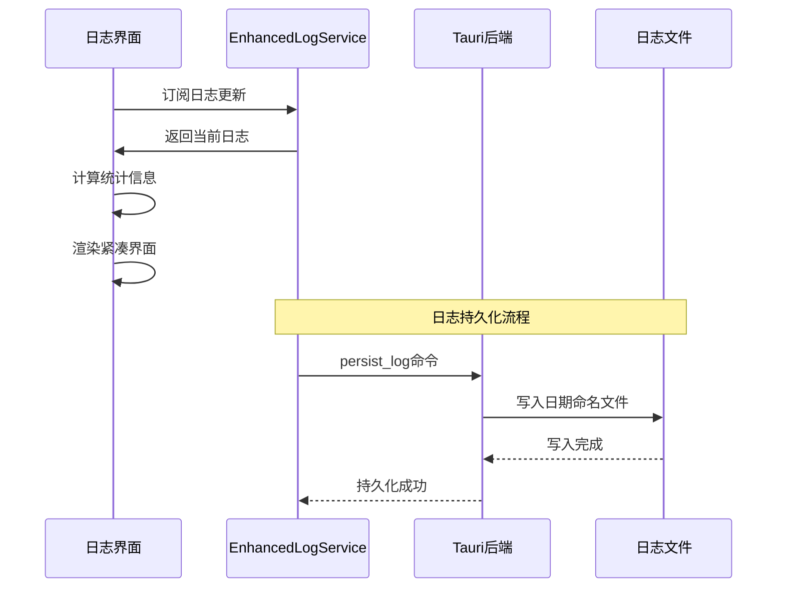
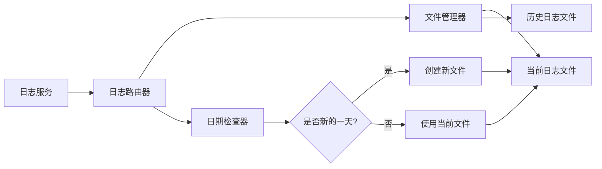

# 日志系统优化设计

## 1. 概述

本设计方案旨在简化并优化ADMT应用的日志系统，将分散的日志统计面板整合到日志查看器中，实现更紧凑高效的界面设计，同时增强日志文件持久化功能，支持按日期自动分割日志文件。

### 1.1 优化目标

- **界面简化**：将独立的日志统计面板合并到日志查看器卡片中
- **统计精简**：仅保留核心统计指标（错误、警告、信息、总计）
- **样式优化**：采用更紧凑、高效的卡片显示样式
- **功能增强**：确保刷新和删除功能正常工作
- **真实数据**：显示实际的日志内容而非模拟数据
- **文件持久化**：实现按日期命名的日志文件自动输出

## 2. 架构设计

### 2.1 组件结构简化



### 2.2 数据流优化



## 3. 界面设计优化

### 3.1 统一卡片布局

采用单一卡片设计，包含以下区域：

#### 头部区域
- 卡片标题："日志查看器"
- 操作按钮：刷新、清空、导出

#### 统计信息区域
采用内联显示方式，包含4个关键指标：

| 指标 | 图标 | 颜色方案 | 说明 |
|------|------|----------|------|
| 错误 | ErrorCircle | #DC143C | 显示错误级别日志数量 |
| 警告 | Warning | #FF8C00 | 显示警告级别日志数量 |
| 信息 | Info | #4169E1 | 显示信息级别日志数量 |
| 总计 | DataHistogram | Brand | 显示总日志数量 |

#### 过滤控制区域
- 日志级别选择器
- 分类过滤器
- 内容搜索框
- 设备筛选器

#### 日志内容区域
- 优化的日志条目显示
- 自动滚动功能
- 分页或虚拟滚动（性能优化）

### 3.2 样式规范

```css
/* 统计信息紧凑布局 */
.statsInline {
  display: "flex",
  gap: "16px",
  padding: "12px 0",
  borderBottom: "1px solid var(--colorNeutralStroke2)"
}

.statItem {
  display: "flex",
  alignItems: "center",
  gap: "6px",
  padding: "6px 12px",
  backgroundColor: "var(--colorNeutralBackground2)",
  borderRadius: "16px",
  fontSize: "12px"
}

.statValue {
  fontWeight: "600",
  minWidth: "20px",
  textAlign: "center"
}

/* 紧凑的日志条目 */
.logEntryCompact {
  padding: "6px 12px",
  fontSize: "12px",
  lineHeight: "1.4",
  borderBottom: "1px solid var(--colorNeutralStroke3)"
}

.logHeader {
  display: "flex",
  alignItems: "center",
  gap: "8px"
}

.logTimestamp {
  minWidth: "80px",
  fontSize: "11px",
  color: "var(--colorNeutralForeground3)"
}
```

## 4. 功能增强设计

### 4.1 刷新功能优化

```typescript
const handleRefreshLogs = useCallback(async () => {
  setIsLoading(true);
  try {
    // 强制重新获取最新日志
    await enhancedLogService.refreshFromBackend();
    
    // 更新统计信息
    await updateStats();
    
    // 记录用户操作
    enhancedLogService.logUserAction("刷新日志", "LogsPanel");
    
    // 显示刷新成功提示
    showSuccessMessage("日志已刷新");
  } catch (error) {
    console.error("刷新日志失败:", error);
    showErrorMessage("刷新失败，请重试");
  } finally {
    setIsLoading(false);
  }
}, []);
```

### 4.2 删除功能增强

```typescript
const handleClearLogs = useCallback(async () => {
  const confirmed = await showConfirmDialog({
    title: "确认清空日志",
    message: "此操作将清空所有日志记录，是否继续？",
    confirmText: "清空",
    cancelText: "取消"
  });
  
  if (!confirmed) return;
  
  setIsLoading(true);
  try {
    // 清空内存和持久化日志
    await enhancedLogService.clearLogs();
    
    // 重置状态
    setFilteredLogs([]);
    setLogStats(null);
    
    // 记录操作
    enhancedLogService.logUserAction("清空日志", "LogsPanel");
    
    showSuccessMessage("日志已清空");
  } catch (error) {
    console.error("清空日志失败:", error);
    showErrorMessage("清空失败，请重试");
  } finally {
    setIsLoading(false);
  }
}, []);
```

## 5. 日志文件持久化设计

### 5.1 文件命名规范

采用日期命名格式：`YY-MM-DD_logs.txt`

- 示例：`25-01-13_logs.txt`（2025年1月13日）
- 每天自动创建新文件
- 支持跨天日志的文件切换

### 5.2 后端实现架构



### 5.3 Rust后端实现

```rust
// 在commands.rs中添加新的日志持久化命令
#[tauri::command]
pub async fn persist_log_to_file(log_entry: String) -> Result<String> {
    use std::fs::OpenOptions;
    use std::io::Write;
    use chrono::Local;
    
    // 解析日志条目
    let entry: StructuredLogEntry = serde_json::from_str(&log_entry)
        .map_err(|e| HoutError::InvalidInput(format!("解析日志失败: {}", e)))?;
    
    // 生成文件名
    let date_str = Local::now().format("%y-%m-%d").to_string();
    let filename = format!("{}_logs.txt", date_str);
    
    // 获取应用数据目录
    let app_data_dir = get_app_data_dir()?;
    let logs_dir = app_data_dir.join("logs");
    
    // 确保日志目录存在
    std::fs::create_dir_all(&logs_dir)
        .map_err(|e| HoutError::IoError(format!("创建日志目录失败: {}", e)))?;
    
    let log_file_path = logs_dir.join(&filename);
    
    // 格式化日志条目
    let formatted_log = format_log_entry(&entry);
    
    // 追加写入文件
    let mut file = OpenOptions::new()
        .create(true)
        .append(true)
        .open(&log_file_path)
        .map_err(|e| HoutError::IoError(format!("打开日志文件失败: {}", e)))?;
    
    writeln!(file, "{}", formatted_log)
        .map_err(|e| HoutError::IoError(format!("写入日志失败: {}", e)))?;
    
    Ok(log_file_path.to_string_lossy().to_string())
}

fn format_log_entry(entry: &StructuredLogEntry) -> String {
    let timestamp = Local::now().format("%H:%M:%S").to_string();
    format!(
        "[{}] [{}] [{}] [{}] {}",
        timestamp,
        entry.level.to_uppercase(),
        entry.category,
        entry.source,
        entry.message
    )
}

#[derive(Deserialize)]
struct StructuredLogEntry {
    level: String,
    category: String,
    source: String,
    message: String,
    timestamp: String,
    context: serde_json::Value,
}
```

### 5.4 前端集成

```typescript
// 在enhancedLogService.ts中更新持久化逻辑
private async persistLog(entry: StructuredLogEntry): Promise<void> {
  try {
    // 同时调用原有的和新的持久化方法
    await Promise.all([
      // 原有的内存持久化
      invoke('persist_log', { logEntry: JSON.stringify(entry) }),
      // 新的文件持久化
      invoke('persist_log_to_file', entry)
    ]);
  } catch (error) {
    console.error("持久化日志失败:", error);
    // 降级处理：如果持久化失败，仍然保持在内存中
  }
}
```

## 6. 性能优化

### 6.1 虚拟滚动实现

对于大量日志的显示性能优化：

```typescript
const VirtualLogList: React.FC<{
  logs: StructuredLogEntry[];
  itemHeight: number;
  containerHeight: number;
}> = ({ logs, itemHeight, containerHeight }) => {
  const [scrollTop, setScrollTop] = useState(0);
  
  const visibleCount = Math.ceil(containerHeight / itemHeight);
  const startIndex = Math.floor(scrollTop / itemHeight);
  const endIndex = Math.min(startIndex + visibleCount + 1, logs.length);
  
  const visibleLogs = logs.slice(startIndex, endIndex);
  
  return (
    <div 
      style={{ height: containerHeight, overflow: 'auto' }}
      onScroll={(e) => setScrollTop(e.currentTarget.scrollTop)}
    >
      <div style={{ height: logs.length * itemHeight, position: 'relative' }}>
        <div style={{ transform: `translateY(${startIndex * itemHeight}px)` }}>
          {visibleLogs.map((log, index) => (
            <LogEntryComponent 
              key={log.id} 
              log={log} 
              style={{ height: itemHeight }}
            />
          ))}
        </div>
      </div>
    </div>
  );
};
```

### 6.2 统计计算优化

使用缓存和增量更新：

```typescript
const useOptimizedLogStats = (logs: StructuredLogEntry[]) => {
  const [stats, setStats] = useState<LogStats | null>(null);
  const [lastLogsLength, setLastLogsLength] = useState(0);
  
  useEffect(() => {
    // 只有当日志数量发生变化时才重新计算
    if (logs.length !== lastLogsLength) {
      const newStats = calculateLogStats(logs);
      setStats(newStats);
      setLastLogsLength(logs.length);
    }
  }, [logs.length, lastLogsLength]);
  
  return stats;
};

const calculateLogStats = (logs: StructuredLogEntry[]): LogStats => {
  const stats = {
    error: 0,
    warning: 0,
    info: 0,
    debug: 0,
    total: logs.length
  };
  
  logs.forEach(log => {
    switch (log.level) {
      case 'error':
      case 'fatal':
        stats.error++;
        break;
      case 'warning':
        stats.warning++;
        break;
      case 'info':
        stats.info++;
        break;
      case 'debug':
        stats.debug++;
        break;
    }
  });
  
  return stats;
};
```

## 7. 实现计划

### 7.1 第一阶段：界面重构
1. 移除独立的统计面板组件
2. 在日志查看器卡片中集成统计信息
3. 优化卡片布局和样式
4. 实现紧凑的统计显示

### 7.2 第二阶段：功能增强
1. 修复刷新功能的数据同步问题
2. 增强删除功能的用户体验
3. 优化过滤和搜索性能
4. 实现虚拟滚动

### 7.3 第三阶段：持久化实现
1. 在Rust后端实现文件持久化命令
2. 更新前端日志服务集成
3. 实现日期自动切换逻辑
4. 添加日志文件管理功能

### 7.4 第四阶段：测试与优化
1. 性能测试和优化
2. 用户体验测试
3. 错误处理完善
4. 文档更新

## 8. 验收标准

### 8.1 界面要求
- [ ] 日志统计面板已移除
- [ ] 统计信息集成到日志查看器卡片中
- [ ] 仅显示错误、警告、信息、总计四个指标
- [ ] 采用紧凑的内联布局
- [ ] 整体界面更加高效简洁

### 8.2 功能要求
- [ ] 刷新功能正常工作，能够获取最新日志
- [ ] 删除功能正常工作，能够清空所有日志
- [ ] 日志内容显示真实数据，非模拟数据
- [ ] 过滤和搜索功能正常
- [ ] 自动滚动功能正常

### 8.3 持久化要求
- [ ] 日志自动输出到文件
- [ ] 按日期命名文件（格式：YY-MM-DD_logs）
- [ ] 每天自动创建新文件
- [ ] 历史日志文件正确保存
- [ ] 文件内容格式正确可读

### 8.4 性能要求
- [ ] 大量日志显示流畅（1000+条）
- [ ] 统计计算响应迅速
- [ ] 内存使用合理
- [ ] 文件I/O不阻塞界面

## 9. 风险评估

### 9.1 技术风险
- **文件I/O性能**：大量日志写入可能影响性能
- **跨平台兼容性**：不同操作系统的文件路径处理
- **内存管理**：长时间运行可能导致内存泄漏

### 9.2 用户体验风险
- **界面变更**：用户需要适应新的界面布局
- **功能缺失**：移除某些统计功能可能影响用户习惯
- **性能影响**：文件持久化可能影响响应速度

### 9.3 风险缓解措施
- 实现异步文件写入，避免阻塞界面
- 提供配置选项允许用户选择持久化策略
- 保留关键统计功能，确保用户体验连续性
- 实施全面的测试和渐进式发布