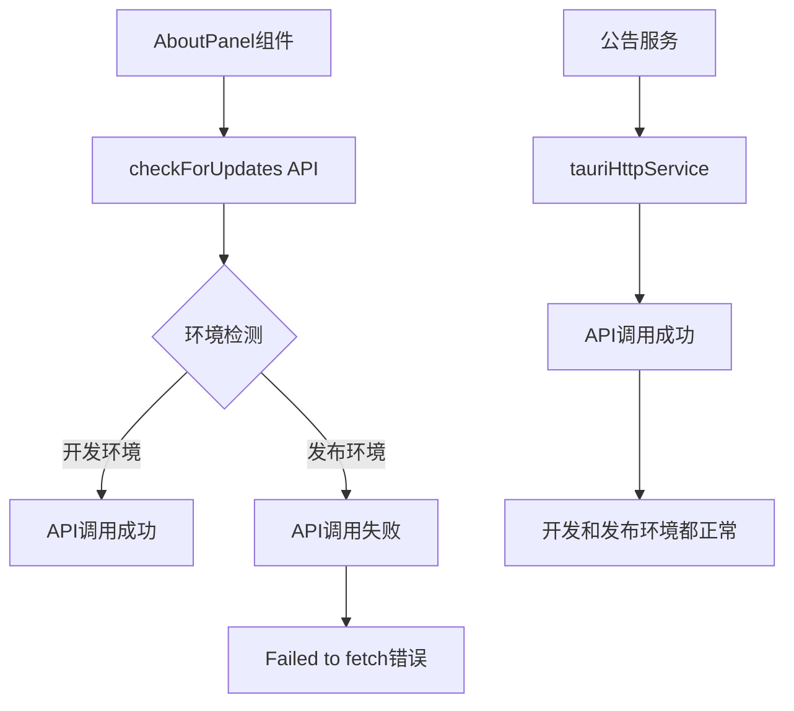
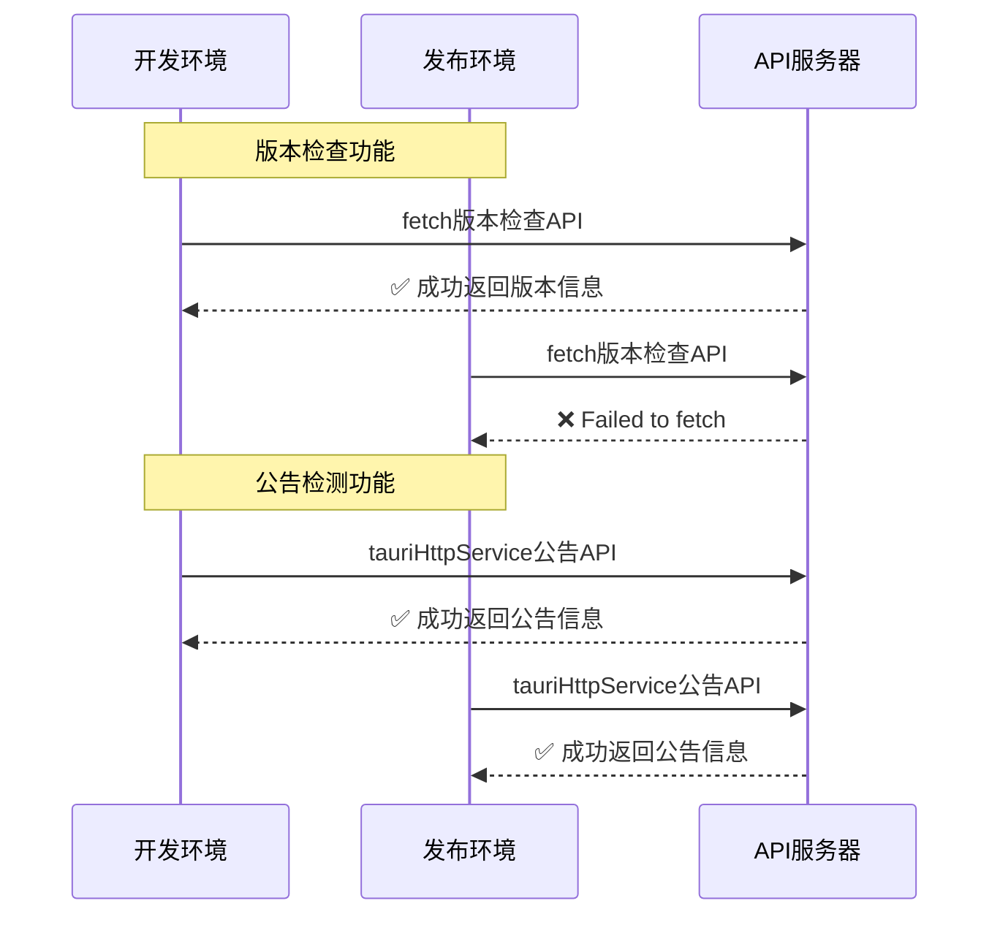
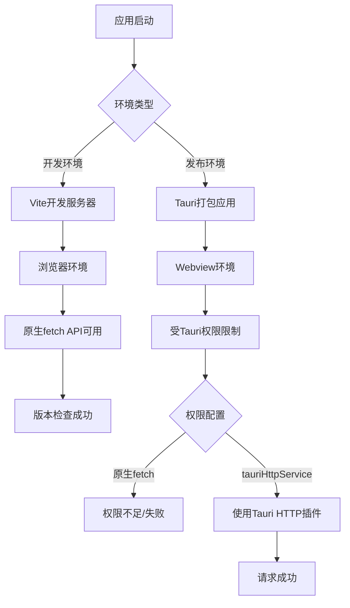
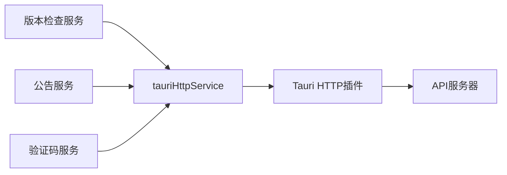
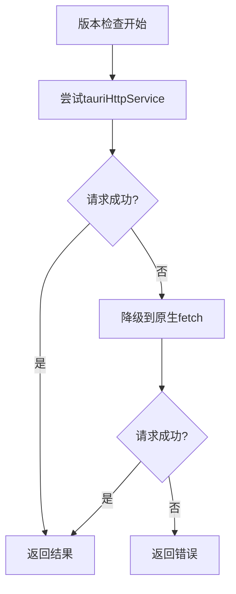
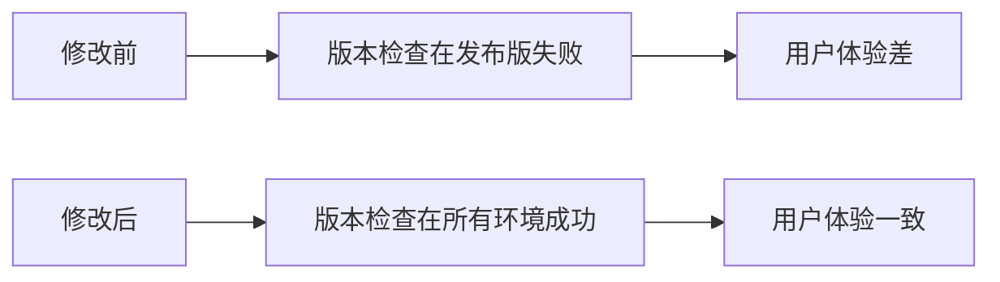

# 开发版与发布版版本检查差异分析设计文档

## 概述

分析并解决版本检查功能在开发版和发布版之间的差异问题。开发版本可以正常检测到新版本，而发布版本却出现"版本检查失败：Failed to fetch"错误。同时，公告检测和验证码相关功能在两个环境中都能正常工作。

## 架构分析

### 当前版本检查架构



### 问题对比分析



## 问题根因分析

### 1. 网络请求方式差异

| 服务 | 请求方式 | 开发环境 | 发布环境 | 状态 |
|------|----------|----------|----------|------|
| 版本检查 | 原生fetch | ✅ 正常 | ❌ 失败 | 有问题 |
| 公告检测 | tauriHttpService | ✅ 正常 | ✅ 正常 | 无问题 |
| 验证码服务 | tauriHttpService | ✅ 正常 | ✅ 正常 | 无问题 |

### 2. CSP策略权限分析

Tauri配置文件中的CSP策略：
```json
"csp": "default-src 'self'; connect-src 'self' https://api-g.lacs.cc; script-src 'self' 'unsafe-inline' 'unsafe-eval'; style-src 'self' 'unsafe-inline'; img-src 'self' data: https:; font-src 'self' data:;"
```

**权限许可**：
- `connect-src 'self' https://api-g.lacs.cc` - 允许连接到API服务器
- 理论上应该支持fetch请求

### 3. Tauri权限配置分析

capabilities/default.json配置：
```json
{
  "identifier": "http:default",
  "allow": [
    { "url": "https://api-g.lacs.cc/**" }
  ]
}
```

**权限许可**：
- HTTP插件允许访问api-g.lacs.cc域名
- 理论上应该支持HTTP请求

### 4. 请求实现差异对比

#### 版本检查服务（versionService.ts）
```typescript
// 使用原生fetch
const response = await fetch('https://api-g.lacs.cc/app/software/id/1', {
  method: 'GET',
  headers: {
    'Accept': 'application/json',
    'User-Agent': 'ADMT-App'
  },
  signal: AbortSignal.timeout(10000)
});
```

#### 公告服务（announcementService.ts）
```typescript
// 使用tauriHttpService
const response = await tauriHttpService.get<AnnouncementResponse>(endpoint, {
  timeout: 10000,
});
```

### 5. 环境差异分析



## 解决方案设计

### 方案1：统一使用tauriHttpService（推荐）

#### 设计理念
将版本检查服务改为使用tauriHttpService，与公告服务保持一致，确保跨环境兼容性。

#### 实现架构


#### 修改点

1. **更新versionService.ts**
```typescript
// 原有实现
const response = await fetch(apiUrl, options);

// 改为
const response = await tauriHttpService.get<VersionResponse>(endpoint, {
  timeout: 10000,
  headers: {
    'Accept': 'application/json',
    'User-Agent': 'ADMT-App'
  }
});
```

2. **统一错误处理**
```typescript
if (!response.success || !response.data) {
  throw new Error(response.error || '版本检查失败');
}
```

### 方案2：增强原生fetch权限配置

#### 检查Tauri配置
确保以下配置正确：

1. **tauri.conf.json的CSP策略**
```json
"csp": "default-src 'self'; connect-src 'self' https://api-g.lacs.cc; ..."
```

2. **capabilities权限配置**
```json
{
  "permissions": [
    {
      "identifier": "http:default",
      "allow": [
        { "url": "https://api-g.lacs.cc/**" }
      ]
    }
  ]
}
```

### 方案3：混合策略（降级处理）

#### 设计思路
优先尝试tauriHttpService，失败时降级到原生fetch。



## 推荐实施方案

### 选择方案1：统一使用tauriHttpService

**理由**：
1. **一致性**：与其他服务（公告、验证码）保持技术栈一致
2. **可靠性**：tauriHttpService已在发布环境验证可用
3. **维护性**：统一的请求处理逻辑，便于维护和调试
4. **兼容性**：确保开发和发布环境行为一致

### 实施步骤

#### 第一步：修改版本检查服务

```typescript
// src/services/versionService.ts
import { tauriHttpService } from './tauriHttpService';

export async function checkForUpdates(): Promise<VersionCheckResult> {
  try {
    const localVersion = await getVersion();
    
    // 使用tauriHttpService替代原生fetch
    const response = await tauriHttpService.get<VersionResponse>('/app/software/id/1', {
      timeout: 10000,
      headers: {
        'Accept': 'application/json',
        'User-Agent': 'ADMT-App'
      }
    });
    
    if (!response.success || !response.data) {
      throw new Error(response.error || '版本检查失败');
    }
    
    const data = response.data;
    // ... 其余逻辑保持不变
  } catch (error) {
    // 统一错误处理
    throw new Error(`版本检查失败: ${error.message}`);
  }
}
```

#### 第二步：更新导入依赖

```typescript
// 添加tauriHttpService导入
import { tauriHttpService } from './tauriHttpService';
```

#### 第三步：验证测试

1. **开发环境测试**
   - 确保版本检查功能正常
   - 验证错误处理机制

2. **发布环境测试**
   - 构建发布版本
   - 测试版本检查功能
   - 对比公告检测功能确保一致性

### 预期效果



## 验证方案

### 测试用例设计

| 测试场景 | 环境 | 操作 | 预期结果 |
|----------|------|------|----------|
| 正常版本检查 | 开发环境 | 点击检查更新 | 显示版本信息或更新提示 |
| 正常版本检查 | 发布环境 | 点击检查更新 | 显示版本信息或更新提示 |
| 网络异常 | 所有环境 | 断网检查更新 | 显示网络错误提示 |
| API异常 | 所有环境 | 错误API端点 | 显示API错误提示 |

### 监控指标

1. **成功率指标**
   - 开发环境版本检查成功率 = 100%
   - 发布环境版本检查成功率 = 100%

2. **一致性指标**
   - 开发与发布环境行为一致性 = 100%
   - 与公告服务技术栈一致性 = 100%

## 总结

通过分析发现，版本检查功能在发布版失败的根本原因是使用了原生fetch而非Tauri提供的HTTP服务。公告检测和验证码服务使用tauriHttpService在所有环境中都能正常工作，证明了这种方案的可行性。

推荐统一使用tauriHttpService作为HTTP请求的标准方式，这样可以确保：
1. 开发和发布环境的一致性
2. 与现有服务架构的统一性
3. 更好的错误处理和调试能力
4. 符合Tauri应用的最佳实践