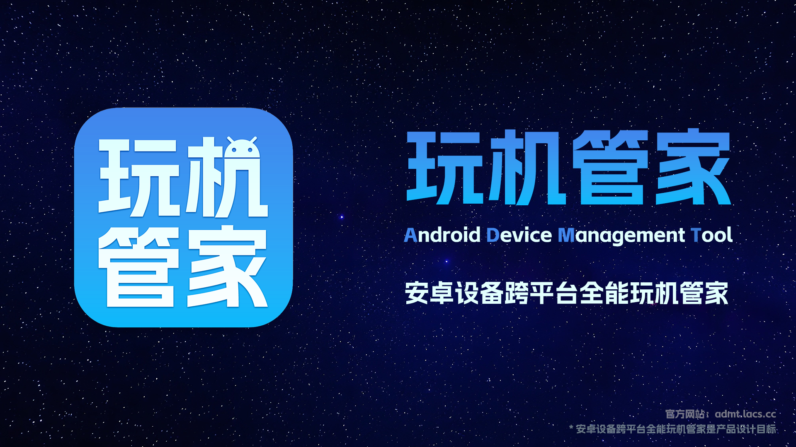

<div align="center">

# 📱 玩机管家 (ADMT - Android Device Management Tools)

**基于 Tauri v2 + React 打造的高性能跨平台 Android 设备全能管理工具**

🌐 **官方网站**: [https://admt.lacs.cc](https://admt.lacs.cc)

[English](./README.en.md) | 简体中文

[](LICENSE)
[](https://tauri.app)
[](https://react.dev)
[](https://www.typescriptlang.org/)

<br />

<p align="center">
  
</p>

</div>

---

## 💡 关于项目

**玩机管家 (ADMT)** 是一款现代化的桌面端 Android 设备管理神器。借助 **Rust + Tauri v2** 架构带来的极致轻量与高性能，相比传统 Electron 应用内存占用降低 80% 以上，启动速度飞快。无论你是 Android 玩机极客、应用开发者、刷机爱好者，还是普通机主，都能通过玩机管家轻松完成各类设备管理操作。

---

## ✨ 核心特性

- ⚡ **高性能跨平台**：基于 Tauri v2 核心，极小的内存占用与打包体积，支持 Windows、macOS 与 Linux。
- 🖥️ **Scrcpy 高帧率屏幕镜像**：一键开启高清低延迟屏幕投屏，支持电脑键盘鼠标控制、剪贴板同步及按键映射。
- 🔌 **全能 ADB 工具箱**：
  - 支持 USB 自动识别与无线 ADB (Wi-Fi 调试) 免线连接。
  - 应用卸载与冻结（免 Root 卸载系统预装垃圾应用）。
  - Shell 终端集成、实时 Logcat 日志抓取与快速导出。
- 📂 **高效文件管理**：可视化的手机文件浏览器，支持电脑与手机间文件拖拽传输、批量管理与权限调整。
- 🤖 **AI 设备诊断助手**：内置 AI 对话工具，协助排查刷机故障、ADB 命令错误及设备异常。
- 🛠️ **内置常用工具链**：集成平台专用 Fastboot/ADB 脚本、USB 驱动修复及各种刷机玩机小工具。

---

## ⚖️ 性能对比

| 特性 / 指标 | 传统 Electron 软件 | 纯命令行工具 (ADB CLI) | **玩机管家 (ADMT)** |
| :--- | :--- | :--- | :--- |
| **内存占用 (RAM)** | ~300MB - 800MB | ~10MB | **~40MB - 90MB** ⚡ |
| **安装包体积** | ~120MB+ | ~5MB | **~15MB - 25MB** 📦 |
| **GUI 可视化** | ✅ 有 | ❌ 无 (纯命令行) | **✅ 现代化 Fluent UI 界面** |
| **无线 ADB / 投屏** | 需配置或付费 | 需手动敲复杂命令 | **✅ 一键自动连接/低延迟投屏** |
| **AI 错误诊断** | ❌ 无 | ❌ 无 | **✅ 内置智能 AI 助手** |

---

## 🛠️ 技术栈

- **前端**：React 18, TypeScript, Fluent UI, Framer Motion, Zustand, Vite
- **后端 / 原生集成**：Rust, Tauri v2
- **嵌入工具**：ADB Platform Tools, Scrcpy, 自定义工具链

---

## 🚀 快速开始

### 预备环境

在开始之前，请确保您的开发环境中已安装：
1. **Node.js** (v18+ 推荐) 与 **npm**
2. **Rust** 编译环境 (`rustc` 及 `cargo`)
3. 各平台对应的 Tauri 构建依赖（参考 [Tauri 官方安装指南](https://tauri.app/v1/guides/getting-started/prerequisites)）

### 运行与构建

1. **克隆仓库**
   ```bash
   git clone https://github.com/LACS-Official/admt.git
   cd admt
   ```

2. **安装依赖**
   ```bash
   npm install
   ```

3. **配置环境变量（可选）**
   复制 `.env.example` 为 `.env` 并调整接口配置：
   ```bash
   cp .env.example .env
   ```

4. **启动开发环境**
   ```bash
   npm run tauri:dev
   ```

5. **构建生产包**
   ```bash
   npm run tauri:build
   ```
   构建完成后，安装包将保存在 `src-tauri/target/release/bundle/` 目录中。

---

## 📁 目录结构

```text
admt/
├── src/                    # React 前端交互与UI界面
│   ├── components/         # 业务组件 (ADB工具, 投屏, 文件管理等)
│   ├── services/           # 业务逻辑与 API 通信
│   ├── stores/             # Zustand 状态管理
│   └── styles/             # 样式文件
├── src-tauri/              # Rust / Tauri 原生层
│   ├── src/                # Rust 源代码 (系统交互、命令处理)
│   ├── tools/              # 集成的二进制工具 (ADB, Scrcpy等)
│   └── tauri.conf.json     # Tauri 配置文件
├── scripts/                # 构建与校验自动化脚本
└── LICENSE                 # 开源许可证 (Apache 2.0)
```

---

## 🤝 参与贡献

欢迎任何形式的贡献！包括但不限于：提交 Bug、提出新功能建议、改进文档或直接提交 Pull Request。

请在提交代码前参阅 [CONTRIBUTING.md](./.github/CONTRIBUTING.md) 了解贡献规范。

---

## 📄 开源许可证

本项目基于 [Apache License 2.0](./LICENSE) 协议开源。
版权所有 © 2020-2026 领创工作室 (LACS Studio) 及项目贡献者。
