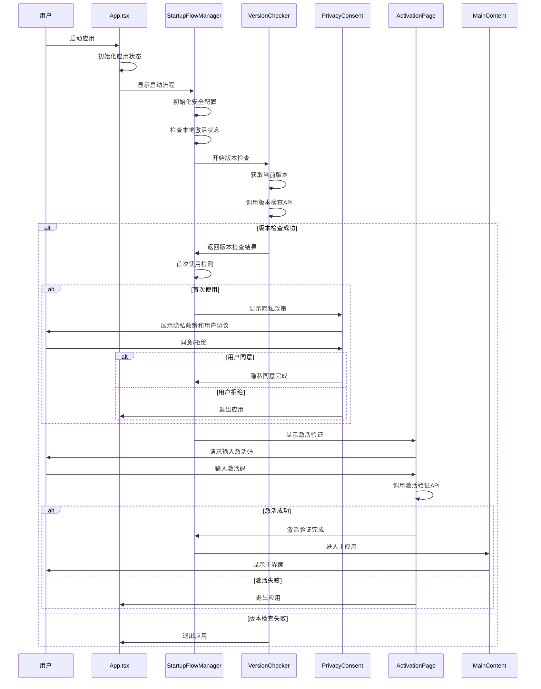
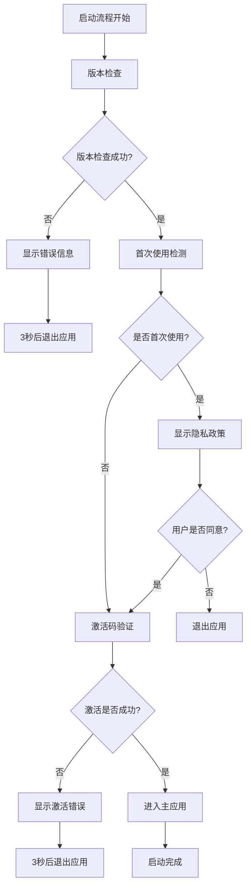

# HOUT应用启动流程技术文档

## 1. 启动流程概述

HOUT应用采用严格的启动流程管理，确保用户在使用前完成必要的验证和配置。整个启动流程分为7个主要阶段：

```mermaid
graph TD
    A[应用启动] --> B[应用初始化]
    B --> C[版本检查]
    C --> D[首次使用检测]
    D --> E{是否首次使用}
    E -->|是| F[隐私政策确认]
    E -->|否| G[激活码验证]帮我写一个软件启动到主页的主要逻辑文档
    F --> H{用户是否同意}
    H -->|同意| G
    H -->|拒绝| I[应用退出]
    G --> J{激活是否成功}vgffffffff
    J -->|成功| K[主界面加载]
    J -->|失败| L[应用退出]
    K --> M[数据收集启动]
    M --> N[启动完成]
```

### 启动阶段定义

| 阶段 | 名称 | 描述 | 必需性 |
|------|------|------|--------|
| 1 | `version-check` | 版本检查和公告显示 | 必需 |
| 2 | `first-launch-detection` | 首次使用检测 | 必需 |
| 3 | `privacy-consent` | 隐私政策和用户协议 | 首次使用必需 |
| 4 | `activation-verification` | 激活码验证 | 必需 |
| 5 | `main-app` | 进入主页面 | 必需 |
| 6 | `data-collection` | 数据收集 | 可选 |
| 7 | `completed` | 完成 | 必需 |

## 2. 各个阶段的详细说明

### 2.1 应用初始化阶段（App.tsx）

**文件位置**: `src/App.tsx`

**主要职责**:
- 初始化应用状态管理器
- 设置启动流程监听
- 处理启动流程完成和错误

**关键代码逻辑**:
```typescript
const initializeApp = async () => {
  try {
    logService.info('开始初始化 HOUT 应用...', 'App');
    
    // 初始化应用状态
    initialize();
    
    // 初始化过程（800ms延迟）
    await new Promise(resolve => setTimeout(resolve, 800));
    
    logService.info('ADMT 应用初始化完成', 'App');
    setIsLoading(false);
  } catch (err) {
    logService.error('应用初始化失败', 'App', err);
    setError('应用初始化失败，请重试');
    setIsLoading(false);
    setShowStartupFlow(false);
  }
};
```

**状态管理**:
- `isLoading`: 控制初始化加载状态
- `showStartupFlow`: 控制是否显示启动流程
- `error`: 存储初始化错误信息

### 2.2 启动流程管理（StartupFlowManager）

**文件位置**: `src/components/StartupFlow/StartupFlowManager.tsx`

**主要职责**:
- 协调整个启动流程的执行
- 管理各阶段之间的状态转换
- 处理错误和重试逻辑

**核心初始化逻辑**:
```typescript
const initializeStartupFlow = async () => {
  try {
    console.log('🚀 开始应用启动流程...');

    // 初始化开发者工具（仅开发模式）
    if (isDevelopment()) {
      console.log('🔧 开发模式：初始化开发者工具');
      devToolsManager.logEnvironmentInfo();
      devToolsManager.enableDebugMode();
    }

    // 重置错误状态
    setError(null);
    resetRetryCount();

    // 初始化安全配置
    console.log('🔐 初始化安全配置...');
    const securityConfig = SecurityConfigManager.getInstance();
    await securityConfig.initialize();

    // 检查本地激活状态（不阻塞启动流程）
    console.log('🔍 检查本地激活状态...');
    await checkLocalActivationStatus();

    // 开始启动流程：阶段1 - 版本检查和公告显示
    setCurrentPhase('version-check');
    setIsInitialized(true);

  } catch (error) {
    console.error('❌ 启动流程初始化失败:', error);
    const errorMessage = error instanceof Error ? error.message : '初始化失败';
    setError(errorMessage);
    onError(errorMessage);
  }
};
```

### 2.3 版本检查和更新检测

**文件位置**: `src/components/StartupFlow/UnifiedLoadingVersionChecker.tsx`

**主要职责**:
- 检查应用当前版本
- 从服务器获取最新版本信息
- 处理强制更新逻辑

**版本检查流程**:
```typescript
const performVersionCheck = async () => {
  try {
    setProgress(85);
    setStatusMessage('初始化安全配置...');
    const configManager = SecurityConfigManager.getInstance();
    await configManager.initialize();

    setProgress(90);
    setStatusMessage('获取当前版本信息...');
    const currentVersion = await getCurrentVersion();

    setProgress(95);
    setStatusMessage('检查最新版本...');
    const result = await checkLatestVersion(currentVersion);

    setProgress(100);
    setStatusMessage('版本检查完成');
    setCheckResult(result);
    
    // 延迟调用完成回调
    const delay = result.isLatest ? 2000 : 4000;
    setTimeout(() => {
      onComplete(result);
    }, delay);

  } catch (error) {
    console.error('❌ 版本检查失败:', error);
    // 版本检查失败时退出应用
    setTimeout(async () => {
      const { exit } = await import('@tauri-apps/api/app');
      await exit(1);
    }, 3000);
  }
};
```

**API调用**:
- 端点: `/app/software/id/{softwareId}`
- 方法: GET
- 安全传输: 使用 `SecureDataTransmissionService`

### 2.4 隐私政策确认

**文件位置**: `src/components/Privacy/PrivacyConsentDialog.tsx`

**主要职责**:
- 显示隐私政策和用户协议
- 收集用户同意状态
- 处理用户拒绝时的应用退出

**同意检查逻辑**:
```typescript
const allRequiredAccepted = acceptedPrivacyPolicy && acceptedUserAgreement && acceptedDataCollection;

const handleAccept = () => {
  if (!allRequiredAccepted) {
    setShowExitConfirm(true);
    return;
  }

  // 更新状态
  if (acceptedPrivacyPolicy) acceptPrivacyPolicy();
  if (acceptedUserAgreement) acceptUserAgreement();
  if (acceptedDataCollection) acceptDataCollection();
  
  completePrivacySetup();
  onAccept();
};
```

**必需同意项**:
1. 隐私政策
2. 用户协议  
3. 数据收集协议

### 2.5 激活码验证

**文件位置**: `src/components/Welcome/pages/ActivationPage.tsx`

**主要职责**:
- 收集用户输入的激活码
- 调用后端验证API
- 处理激活成功/失败状态

**激活验证流程**:
```typescript
const handleActivate = async () => {
  if (!activationCode.trim()) {
    setError('请输入激活码');
    return;
  }

  setLoading(true);
  setError('');

  try {
    const response = await activationService.activate({
      activationCode: activationCode.trim(),
      userConfig: {
        username: 'user',
        deviceId: 'device-001',
        preferences: {}
      }
    });

    if (response.success) {
      setActivationStatus('activated');
      setActivationVerified(true);
      
      if (onSuccess) {
        onSuccess(response);
      }
    } else {
      setActivationStatus('activation_failed');
      setError(response.message || '激活失败，请检查激活码是否正确');
      
      if (onError) {
        onError(response.message || '激活失败');
      }
    }
  } catch (error) {
    console.error('激活过程中发生错误:', error);
    setActivationStatus('activation_failed');
    const errorMessage = error instanceof Error ? error.message : '网络错误，请稍后重试';
    setError(errorMessage);
  } finally {
    setLoading(false);
  }
};
```

### 2.6 主界面加载

**文件位置**: `src/components/MainContent/MainContent.tsx`

**主要职责**:
- 初始化主应用界面
- 启动设备扫描服务
- 加载用户配置和状态

**主界面组件结构**:
```typescript
return (
  <div className={styles.app}>
    <TitleBar />      {/* 标题栏和窗口控制 */}
    <MainContent />   {/* 主要内容区域 */}
    <StatusBar />     {/* 状态栏 */}
    <NotificationContainer /> {/* 通知容器 */}
  </div>
);
```

## 3. 关键组件和文件

### 3.1 React组件

| 组件名称 | 文件路径 | 主要功能 |
|----------|----------|----------|
| `App` | `src/App.tsx` | 应用根组件，控制启动流程显示 |
| `StartupFlowManager` | `src/components/StartupFlow/StartupFlowManager.tsx` | 启动流程协调器 |
| `UnifiedLoadingVersionChecker` | `src/components/StartupFlow/UnifiedLoadingVersionChecker.tsx` | 版本检查组件 |
| `PrivacyConsentDialog` | `src/components/Privacy/PrivacyConsentDialog.tsx` | 隐私政策对话框 |
| `ActivationPage` | `src/components/Welcome/pages/ActivationPage.tsx` | 激活码验证页面 |
| `TitleBar` | `src/components/TitleBar/TitleBar.tsx` | 应用标题栏 |
| `MainContent` | `src/components/MainContent/MainContent.tsx` | 主要内容区域 |

### 3.2 状态管理Store

| Store名称 | 文件路径 | 管理内容 |
|-----------|----------|----------|
| `useStartupFlowStore` | `src/stores/startupFlowStore.ts` | 启动流程状态和阶段管理 |
| `useAppStore` | `src/stores/appStore.ts` | 应用全局状态和配置 |
| `useWelcomeStore` | `src/stores/welcomeStore.ts` | 欢迎页面和激活状态 |
| `useAppConfigStore` | `src/stores/welcomeStore.ts` | 应用配置持久化 |
| `usePrivacyConsentStore` | `src/stores/privacyConsentStore.ts` | 隐私同意状态 |

### 3.3 服务类

| 服务名称 | 文件路径 | 主要功能 |
|----------|----------|----------|
| `activationService` | `src/services/activationService.ts` | 激活码验证服务 |
| `versionService` | `src/services/versionService.ts` | 版本检查服务 |
| `SecureDataTransmissionService` | `src/services/secureDataTransmissionService.ts` | 安全数据传输 |
| `logService` | `src/services/logService.ts` | 日志记录服务 |
| `userBehaviorService` | `src/services/userBehaviorService.ts` | 用户行为统计 |

## 4. 状态流转

### 4.1 启动流程状态机

```typescript
// 阶段顺序映射
const phaseOrder: StartupPhase[] = [
  'version-check',           // 版本检查
  'first-launch-detection',  // 首次使用检测
  'privacy-consent',         // 隐私政策同意
  'activation-verification', // 激活码验证
  'main-app',               // 主应用
  'data-collection',        // 数据收集
  'completed'               // 完成
];
```

### 4.2 条件判断逻辑

```typescript
const handleFirstLaunchDetection = () => {
  const isFirstTime = privacyConsentStore.isFirstLaunch || 
                     !privacyConsentStore.hasCompletedPrivacySetup;

  setIsFirstLaunch(isFirstTime);
  setFirstLaunchDetected(true);

  if (isFirstTime) {
    // 首次使用：进入隐私政策阶段
    setCurrentPhase('privacy-consent');
  } else {
    // 非首次使用：直接进入激活验证
    setCurrentPhase('activation-verification');
  }
};
```

### 4.3 状态持久化

使用Zustand的persist中间件实现状态持久化：

```typescript
export const useStartupFlowStore = create<StartupFlowState & StartupFlowActions>()(
  persist(
    (set, get) => ({
      // ... 状态和操作
    }),
    {
      name: 'hout-startup-flow-storage',
      storage: createJSONStorage(() => localStorage),
      partialize: (state) => ({
        userType: state.userType,
        isFirstLaunch: state.isFirstLaunch,
        userSettings: state.userSettings,
        activationStatus: state.activationStatus,
      }),
    }
  )
);
```

## 5. 错误处理机制

### 5.1 版本检查错误处理

**策略**: 严格模式 - 失败即退出

```typescript
// 版本检查失败处理
catch (error) {
  console.error('❌ 版本检查失败:', error);
  const errorMessage = error instanceof Error ? error.message : '版本检查失败';
  setError(errorMessage);

  // 根据要求，版本检查失败时立即退出应用
  setTimeout(async () => {
    try {
      const { exit } = await import('@tauri-apps/api/app');
      await exit(1);
    } catch (exitError) {
      console.error('退出应用失败:', exitError);
      window.close();
    }
  }, 3000);

  onError(`${errorMessage}\n\n应用将在3秒后退出`);
}
```

**错误类型**:
- 网络连接失败
- API响应错误
- 数据解析错误
- 安全配置初始化失败

### 5.2 激活验证错误处理

**策略**: 严格模式 - 失败即退出

```typescript
const handleActivationError = (error: string) => {
  console.error('❌ 激活验证失败:', error);
  setError(error);

  // 强制激活验证失败时不允许继续使用
  console.log('🚫 激活验证失败，应用将退出');

  setTimeout(async () => {
    try {
      const { exit } = await import('@tauri-apps/api/app');
      await exit(1);
    } catch (exitError) {
      console.error('退出应用失败:', exitError);
      window.close();
    }
  }, 3000);

  onError(`激活验证失败: ${error}\n\n应用将在3秒后退出`);
};
```

**错误分类**:
- `expired`: 激活码已过期
- `used`: 激活码已被使用
- `invalid`: 激活码无效或不存在
- `network`: 网络连接问题

### 5.3 重试机制

**用户行为统计服务重试**:
```typescript
// 重试离线缓存中的数据
async retryOfflineCache(): Promise<void> {
  const cache: OfflineCacheItem[] = JSON.parse(existingCache);
  const remainingCache: OfflineCacheItem[] = [];

  for (const item of cache) {
    if (item.retryCount >= this.config.maxRetryCount) {
      console.log(`缓存项重试次数已达上限，丢弃: ${item.id}`);
      continue;
    }

    const success = await this.sendRequest(endpoint, item.data, item.type);

    if (!success) {
      item.retryCount++;
      remainingCache.push(item);
    }
  }
}
```

**重试配置**:
- 最大重试次数: 3次
- 重试间隔: 5秒
- 指数退避: 1秒 × 尝试次数

### 5.4 错误日志记录

**Rust后端错误处理**:
```rust
#[derive(Error, Debug, Serialize, Deserialize)]
pub enum HoutError {
    #[error("ADB command failed: {message}")]
    AdbCommandFailed { message: String },

    #[error("Device not found: {serial}")]
    DeviceNotFound { serial: String },

    #[error("Network error: {0}")]
    Network(String),

    #[error("Tool error: {0}")]
    Tool(String),

    // ... 其他错误类型
}
```

## 6. 配置和环境

### 6.1 开发模式 vs 生产模式

**开发模式特性**:
```typescript
if (isDevelopment()) {
  console.log('🔧 开发模式：初始化开发者工具');
  devToolsManager.logEnvironmentInfo();
  devToolsManager.enableDebugMode();

  // 添加快捷键显示调试面板
  const handleKeyDown = (event: KeyboardEvent) => {
    if (event.ctrlKey && event.shiftKey && event.key === 'D') {
      event.preventDefault();
      setShowDebugPanel(prev => !prev);
    }
  };
}
```

**生产模式限制**:
- 禁用开发者工具按钮
- 禁用右键菜单
- 禁用F12和开发者快捷键
- 严格的错误处理（失败即退出）

### 6.2 环境配置

**API端点配置**:
```typescript
const API_CONFIG = {
  development: {
    baseUrl: 'http://localhost:3000',
    versionCheckUrl: 'https://api-g.lacs.cc/app/software/id/1'
  },
  production: {
    baseUrl: 'https://api.lacs.cc',
    versionCheckUrl: 'https://api-g.lacs.cc/app/software/id/1'
  }
};
```

**安全配置**:
- 数据传输加密
- 请求签名验证
- 设备指纹识别
- 激活码哈希存储

### 6.3 Tauri配置

**窗口配置**:
```json
{
  "windows": [{
    "title": "玩机管家",
    "width": 1280,
    "height": 800,
    "resizable": false,
    "decorations": false,
    "center": true
  }]
}
```

**权限配置**:
- 文件系统访问
- 网络请求
- 系统命令执行
- 设备信息读取

## 7. 关键代码片段

### 7.1 启动流程状态管理

```typescript
// 启动流程阶段定义
export type StartupPhase =
  | 'version-check'           // 版本检查和公告显示
  | 'first-launch-detection'  // 首次使用检测
  | 'privacy-consent'         // 隐私政策和用户协议
  | 'activation-verification' // 激活码验证
  | 'main-app'                // 进入主页面
  | 'data-collection'         // 数据收集
  | 'completed';              // 完成

// 状态检查函数
export const canProceedToNextPhase = (phase: StartupPhase, state: StartupFlowState): boolean => {
  switch (phase) {
    case 'version-check':
      return state.versionCheckCompleted && state.announcementDisplayed;
    case 'first-launch-detection':
      return state.firstLaunchDetected;
    case 'privacy-consent':
      return state.privacyConsentCompleted;
    case 'activation-verification':
      return state.activationVerified;
    case 'main-app':
      return state.mainAppEntered;
    case 'data-collection':
      return state.dataCollectionStarted;
    case 'completed':
      return true;
    default:
      return false;
  }
};
```

### 7.2 安全数据传输

```typescript
// 安全请求发送
const response = await transmissionService.sendSecureRequest(`/app/software/id/${softwareId}`);

if (!response.success || !response.data) {
  throw new Error(response.error || '版本检查失败：无效的响应数据');
}

const softwareInfo = response.data;
const latestVersionNumber = softwareInfo.currentVersion || currentVersion;
const isLatest = compareVersions(currentVersion, latestVersionNumber) >= 0;
```

### 7.3 激活状态检查

```typescript
const checkLocalActivationStatus = async () => {
  try {
    const { invoke } = await import('@tauri-apps/api/core');
    const activationInfo = await invoke('check_activation_status');

    if (activationInfo.isActivated && !activationInfo.isExpired) {
      console.log('✅ 检测到有效激活状态');
      setActivationStatus(activationInfo);
      updateUserSettings({ isFirstLaunch: false });
    } else if (activationInfo.isExpired) {
      console.log('⏰ 检测到过期激活状态');
      setActivationStatus(activationInfo);
      updateUserSettings({ isFirstLaunch: false });
    } else {
      console.log('ℹ️ 未检测到有效激活状态');
    }
  } catch (error) {
    console.warn('检查本地激活状态失败:', error);
  }
};
```

## 8. 流程图和时序图

### 8.1 完整启动流程图



### 8.2 错误处理流程图



## 9. 总结

HOUT应用的启动流程设计具有以下特点：

### 9.1 设计原则

1. **安全第一**: 严格的版本检查和激活验证机制
2. **用户体验**: 清晰的进度指示和友好的错误提示
3. **数据安全**: 加密传输和本地安全存储
4. **状态管理**: 完善的状态持久化和恢复机制
5. **错误处理**: 针对不同场景的差异化错误处理策略

### 9.2 技术特色

1. **模块化设计**: 每个阶段独立组件，便于维护和测试
2. **状态驱动**: 基于状态机的流程控制，逻辑清晰
3. **类型安全**: 完整的TypeScript类型定义
4. **跨平台**: 基于Tauri的桌面应用框架
5. **现代化UI**: 使用Fluent UI组件库

### 9.3 安全保障

1. **网络安全**: HTTPS传输和请求签名验证
2. **数据保护**: 敏感信息加密存储
3. **访问控制**: 基于激活码的功能访问控制
4. **审计日志**: 完整的操作日志记录

### 9.4 可维护性

1. **清晰的代码结构**: 按功能模块组织代码
2. **完善的错误处理**: 统一的错误处理机制
3. **详细的日志记录**: 便于问题排查和调试
4. **配置化管理**: 环境相关配置外部化

这种设计确保了HOUT应用在提供强大功能的同时，保持了高度的安全性、稳定性和用户友好性。
