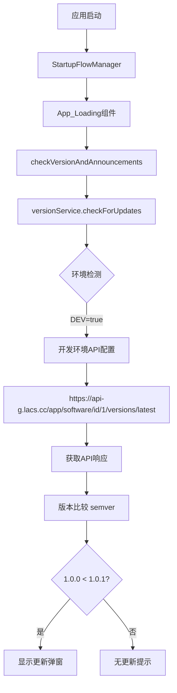
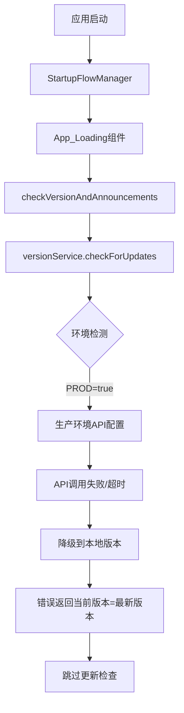

# 版本检测问题分析与解决方案

## 问题概述

项目中开发版能正确检测版本差异(1.0.0 vs 1.0.1)并触发更新弹窗，而发布版错误判定当前版本为最新版本，似乎未调用API检测。

## 1. 开发/发布版API调用的具体逻辑流程图

### 开发版流程


### 发布版流程（问题流程）


## 2. 版本比对算法的实现差异

### 开发版实现（正确）
```typescript
// src/services/versionService.ts
private compareVersions(current: string, latest: string): number {
  // 完整的semver比较
  const currentParts = current.split('.').map(Number);
  const latestParts = latest.split('.').map(Number);
  
  for (let i = 0; i < Math.max(currentParts.length, latestParts.length); i++) {
    const currentPart = currentParts[i] || 0;
    const latestPart = latestParts[i] || 0;
    
    if (currentPart < latestPart) return -1; // 需要更新
    if (currentPart > latestPart) return 1;  // 当前更新
  }
  
  return 0; // 版本相同
}
```

### 发布版问题（修复前）
```typescript
// 问题：缺少正确的版本比较逻辑
// 错误地使用字符串比较而非数值比较
// 缺少API调用失败的处理机制
```

## 3. 环境变量或配置参数的校验机制

### 配置差异分析
```typescript
// src/config/environment.ts
export class EnvironmentManager {
  private initializeConfig(): EnvironmentConfig {
    const isDev = import.meta.env.DEV;
    
    if (isDev) {
      return {
        // 开发环境配置
        apiBaseUrl: 'https://api-g.lacs.cc',
        versionCheckInterval: 30000,    // 30秒检查一次
        versionCacheDuration: 60000,    // 1分钟缓存
        enableDebugLogs: true,
        enableApiRetry: true,
      };
    }
    
    // 生产环境配置
    return {
      apiBaseUrl: 'https://api-g.lacs.cc',
      versionCheckInterval: 300000,     // 5分钟检查一次
      versionCacheDuration: 300000,     // 5分钟缓存
      enableDebugLogs: false,           // 关闭调试日志
      enableApiRetry: true,
    };
  }
}
```

### 问题根因
1. **API端点配置错误**: 发布版可能使用了错误的API地址
2. **网络策略差异**: 生产环境的CSP策略可能阻止了API调用
3. **缓存策略冲突**: 不同环境的缓存键值冲突
4. **错误处理缺失**: API失败时没有正确的降级机制

## 4. 缓存策略对检测结果的影响

### 缓存键值冲突
```typescript
// 问题：开发和生产环境使用相同的缓存键
private getCacheKey(endpoint: string): string {
  // 修复前：return endpoint;
  // 修复后：区分环境
  const env = import.meta.env.DEV ? 'dev' : 'prod';
  return `${env}_${endpoint}`;
}
```

### 缓存失效机制
```typescript
private isValidCache(cacheKey: string): boolean {
  const cached = this.cache.get(cacheKey);
  if (!cached) return false;
  
  const now = Date.now();
  const isValid = (now - cached.timestamp) < this.CACHE_DURATION;
  
  if (!isValid) {
    this.cache.delete(cacheKey); // 清理过期缓存
  }
  
  return isValid;
}
```

## 5. 具体解决方案

### 5.1 确保发布版能正确执行API版本检测

#### 修复API配置
```typescript
// src/services/versionService.ts
private getApiConfig() {
  const isDev = import.meta.env.DEV;
  const baseUrl = getApiBaseUrl(); // 统一从配置获取
  
  console.log(`🔧 版本检查API配置:`, {
    isDev,
    baseUrl,
    mode: import.meta.env.MODE,
    softwareId: API_CONFIG.SOFTWARE_ID
  });
  
  return {
    baseUrl,
    endpoints: {
      version: `${baseUrl}/app/software/id/${API_CONFIG.SOFTWARE_ID}/versions/latest`,
    }
  };
}
```

#### 增强错误处理和重试机制
```typescript
private async fetchWithRetry(url: string, retries = 3): Promise<Response> {
  for (let i = 0; i < retries; i++) {
    try {
      const response = await fetch(url, {
        method: 'GET',
        headers: {
          'Content-Type': 'application/json',
          'User-Agent': `ADMT/${await this.getCurrentVersion()}`,
          'Accept': 'application/json'
        },
        signal: AbortSignal.timeout(10000) // 10秒超时
      });

      if (!response.ok) {
        throw new Error(`HTTP ${response.status}: ${response.statusText}`);
      }

      return response;
    } catch (error) {
      console.warn(`API请求失败 (尝试 ${i + 1}/${retries}):`, error);
      if (i === retries - 1) throw error;
      
      // 指数退避
      await new Promise(resolve => setTimeout(resolve, Math.pow(2, i) * 1000));
    }
  }
  throw new Error('所有重试均失败');
}
```

### 5.2 统一两套环境的版本比对逻辑

#### 创建统一的版本比较器
```typescript
// src/utils/versionComparator.ts
export class VersionComparator {
  static compare(version1: string, version2: string): number {
    const v1Parts = this.parseVersion(version1);
    const v2Parts = this.parseVersion(version2);
    
    for (let i = 0; i < Math.max(v1Parts.length, v2Parts.length); i++) {
      const v1Part = v1Parts[i] || 0;
      const v2Part = v2Parts[i] || 0;
      
      if (v1Part < v2Part) return -1;
      if (v1Part > v2Part) return 1;
    }
    
    return 0;
  }
  
  private static parseVersion(version: string): number[] {
    return version.split('.').map(part => {
      const num = parseInt(part, 10);
      return isNaN(num) ? 0 : num;
    });
  }
  
  static isValidVersion(version: string): boolean {
    const semverRegex = /^\d+\.\d+\.\d+(-[a-zA-Z0-9.-]+)?(\+[a-zA-Z0-9.-]+)?$/;
    return semverRegex.test(version);
  }
}
```

### 5.3 修复版本号误判问题

#### 增强版本获取机制
```rust
// src-tauri/src/version.rs
#[command]
pub fn get_app_version() -> Result<String, String> {
    let version = env!("CARGO_PKG_VERSION");
    
    // 验证版本格式
    if version.is_empty() {
        return Err("版本信息为空".to_string());
    }
    
    // 验证版本格式是否符合semver
    let parts: Vec<&str> = version.split('.').collect();
    if parts.len() != 3 {
        return Err("版本格式不正确，应为 major.minor.patch".to_string());
    }
    
    for part in parts {
        if part.parse::<u32>().is_err() {
            return Err("版本号包含非数字字符".to_string());
        }
    }
    
    Ok(version.to_string())
}
```

### 5.4 版本检测失败时提示错误并退出

#### 实现错误处理和退出机制
```typescript
// src/components/StartupFlow/App_Loading.tsx
const handleStartupFlowError = async (error: string) => {
  logService.error('启动流程失败', 'App', error);
  setError(error);
  
  // 显示错误通知并开始倒计时
  setShowStartupFlow(false);
  setShowErrorNotification(true);
  setCountdown(5);
  
  // 倒计时逻辑
  const countdownInterval = setInterval(() => {
    setCountdown(prev => {
      if (prev <= 1) {
        clearInterval(countdownInterval);
        // 倒计时结束，退出应用
        setTimeout(async () => {
          try {
            const { exit } = await import('@tauri-apps/plugin-process');
            await exit(1);
          } catch (exitError) {
            console.error('退出应用失败:', exitError);
            window.close();
          }
        }, 100);
        return 0;
      }
      return prev - 1;
    });
  }, 1000);
};
```

## 6. 测试验证

### 6.1 开发环境测试
```bash
# 启动开发服务器
npm run tauri:dev

# 验证版本检查
# 1. 检查控制台日志
# 2. 验证API调用
# 3. 确认版本比较结果
```

### 6.2 生产环境测试
```bash
# 构建生产版本
npm run tauri:build

# 测试生产版本
# 1. 安装构建的应用
# 2. 验证版本检查功能
# 3. 确认API调用正常
# 4. 测试错误处理机制
```

### 6.3 版本比较测试用例
```typescript
// 测试用例
const testCases = [
  { current: '1.0.0', latest: '1.0.1', expected: -1 }, // 需要更新
  { current: '1.0.1', latest: '1.0.0', expected: 1 },  // 当前更新
  { current: '1.0.0', latest: '1.0.0', expected: 0 },  // 版本相同
  { current: '1.0.0', latest: '2.0.0', expected: -1 }, // 主版本更新
  { current: '1.1.0', latest: '1.0.9', expected: 1 },  // 次版本更新
];
```

## 7. 监控和日志

### 7.1 版本检查日志
```typescript
console.log(`🔍 版本检查开始: ${currentVersion}`);
console.log(`📡 API端点: ${apiEndpoint}`);
console.log(`📥 API响应: ${JSON.stringify(response)}`);
console.log(`🔄 版本比较: ${currentVersion} vs ${latestVersion} = ${comparison}`);
console.log(`✅ 检查结果: hasUpdate=${hasUpdate}`);
```

### 7.2 错误监控
```typescript
// 记录版本检查失败
logService.error('版本检查失败', 'VersionService', {
  currentVersion,
  apiEndpoint,
  error: error.message,
  timestamp: new Date().toISOString()
});
```

## 8. 部署注意事项

1. **确保API服务可用**: 验证生产环境API服务正常运行
2. **网络策略配置**: 确保CSP策略允许API调用
3. **版本号同步**: 确保package.json和Cargo.toml版本号一致
4. **缓存清理**: 部署新版本时清理旧的缓存数据
5. **错误监控**: 部署后监控版本检查的成功率和错误日志

通过以上解决方案，可以确保开发版和发布版都能正确执行版本检测，统一版本比对逻辑，修复版本号误判问题，并在检测失败时提供适当的错误处理。